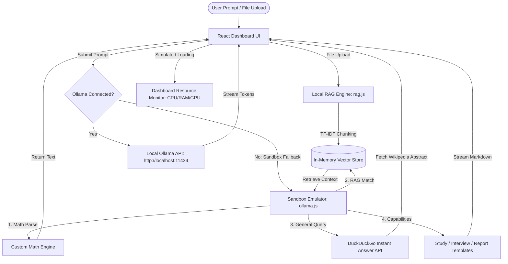

# 💻 SmartDesk AI: Privacy-First Local AI Assistant

SmartDesk AI is a premium, secure, local-first productivity dashboard and AI assistant. Designed to operate completely offline or under restricted network conditions, it leverages Small Language Models (SLMs) running locally via Ollama, integrates an in-memory client-side RAG engine, and features a sleek glassmorphic user interface.

## 🌐 Live Demonstration
* **Production Build (GitHub Pages)**: [https://saurabhsingh8586.github.io/SmartDesk-AI/](https://saurabhsingh8586.github.io/SmartDesk-AI/)
* **Alternative Build (Surge)**: [http://smartdesk-ai-local-7462.surge.sh/](http://smartdesk-ai-local-7462.surge.sh/)

---

## 🏗️ System Workflow Architecture

This workflow diagram illustrates how user actions, local files, the RAG engine, and the Ollama/Sandbox execution paths interact:



---

## ✨ Key Features

1. **💬 Local AI Chat Hub**: Supports real-time streaming, chat history, markdown rendering (code highlights, blocks), and direct configurations.
2. **📄 Client-Side RAG (Retrieval-Augmented Generation)**: Uses a built-in TF-IDF similarity vector matching engine (`src/utils/rag.js`) to index uploaded text/markdown documents and answer questions based entirely on your local files.
3. **🧠 Intelligent Sandbox Fallback**: Works without Ollama using an asynchronous mock generator (`src/utils/ollama.js`) that handles:
   * **General Knowledge & Definitions**: Fetches real-time abstract data via a custom CORS-friendly preprocessor for the DuckDuckGo API.
   * **Custom Calculations**: Parses mathematical statements dynamically.
   * **Study Suite**: Generates practice quizzes and active-recall guidelines.
   * **Interview Prep**: Guides users using the STAR behavioral framework.
   * **Report Generator**: Outputs structured executive and meeting summaries.
4. **📊 Operations Control Center**: Real-time mock dashboard graphing CPU, RAM, and GPU workloads, responding dynamically during AI generation to mimic system stress.
5. **🎙️ Hands-Free Dictation**: Supports client-side Voice-to-Text using the Web Speech API.

---

## 🛠️ Tech Stack & Tools

The application leverages a lightweight, modern technology stack designed for responsiveness, performance, and data security:

* **React 19 & Vite**: Component-based user interface structure bundled with Vite for near-instant hot module replacement (HMR) and optimized build times.
* **Vanilla CSS (HSL Tokens)**: Fully custom design system featuring responsive glassmorphic cards, custom animations, glowing drop shadows, and active HSL color palettes.
* **Ollama (SLM Engine)**: Powering offline, CPU/GPU-driven inference using Small Language Models (e.g. Phi-3, Llama-3) via localhost port `11434`.
* **Local RAG (Vector Search)**: Custom client-side search parser (`src/utils/rag.js`) implementing TF-IDF tokenization, word boundaries filtering, and cosine similarity indexing to perform semantic document search.
* **DuckDuckGo Instant Answer API**: Acts as an asynchronous fallback knowledge base using CORS-friendly definition/abstract lookups.
* **Web Speech API**: Powers client-side, browser-native Voice-to-Text translation.
* **Lucide React & Canvas Confetti**: Modern visual iconography and celebration micro-animations.
* **Oxlint**: Rust-based linting engine ensuring code cleanliness with high compilation speeds.

---

## 🚀 Local Installation & Setup

### Prerequisites
* **Node.js** (v18 or higher)
* **Ollama** (Install from [ollama.com](https://ollama.com))

### 1. Configure Local SLM (Ollama)
To enable the live AI connection, download and run a local language model:
```bash
# Pull the lightweight Phi-3 model
ollama pull phi3:latest

# Or pull Llama-3
ollama pull llama3:latest
```

Ensure Ollama is running in the background. It will serve on `http://localhost:11434`.

### 2. Set Up the Dashboard
```bash
# Clone the repository
git clone https://github.com/SAURABHSINGH8586/SmartDesk-AI.git
cd SmartDesk-AI

# Install dependencies
npm install

# Run the development server
npm run dev
```
Open **`http://localhost:5173`** in your browser.

---

## 🛠️ Build & Deploy Commands

### Compile Production Build
```bash
npm run build
```
This writes portable assets with relative base paths inside the `dist/` directory.

### Deploy to GitHub Pages
```bash
npm run deploy
```
*(This builds the project and publishes the compiled folder directly to your repository's `gh-pages` branch).*
